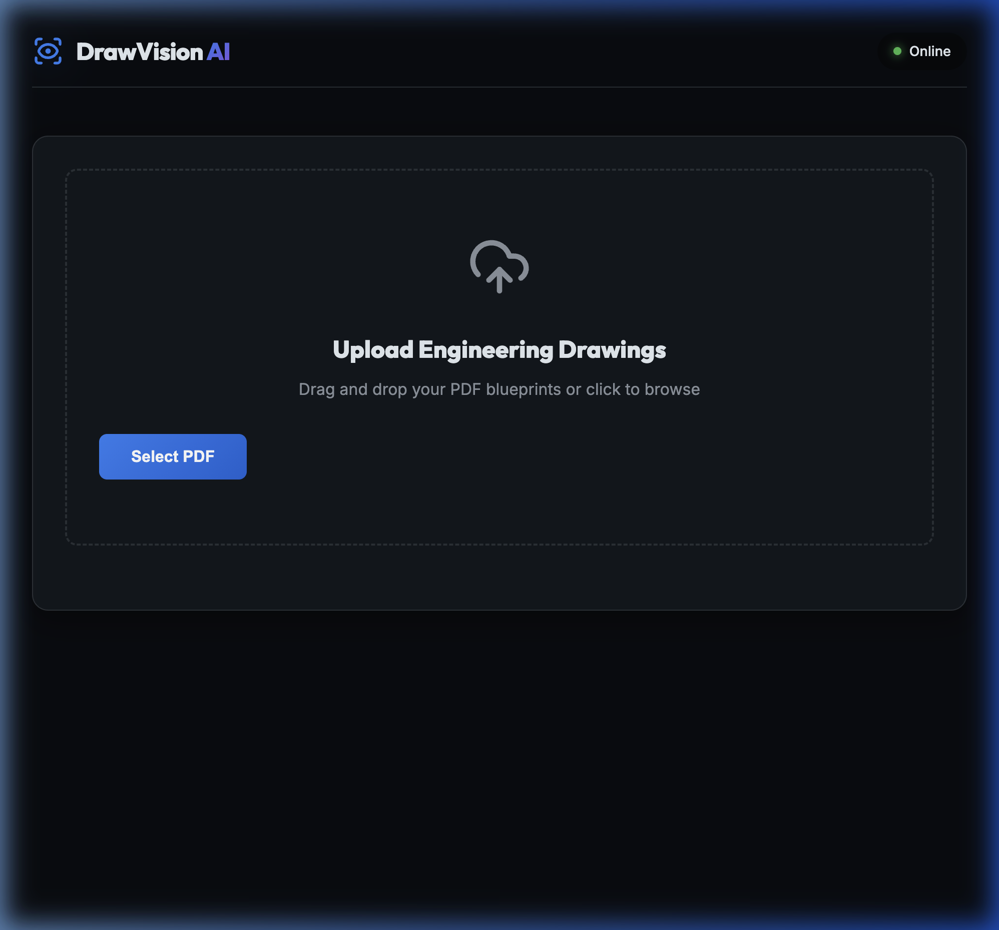

# DrawVision AI — Intelligent Engineering Detection

DrawVision AI is a powerful tool designed to automate the extraction of piping specifications from engineering drawings (PDFs). It combines the object detection capabilities of **YOLO** with the multi-extraction power of **Gemini 2.0 Flash** to provide accurate, structured data in seconds.



## 🚀 Features
- **Real-time Detection**: Watch the pipeline process pages live via WebSockets.
- **Intelligent Extraction**: Uses Gemini AI to parse complex piping codes (Diameter, Service Code, Line Number, Piping Class, etc.) directly from drawing crops.
- **Visual Feedback**: View annotated images with YOLO-detected bounding boxes as they are processed.
- **Exportable Results**: Download the final extraction in perfectly structured **CSV** or **Excel** formats.
[Deteted Pipes Specifications]

[Annotaed Pipe Anchors]

## 🛠️ Tech Stack
- **Backend**: FastAPI (Python)
- **Object Detection**: Ultralytics YOLO26m
- **OCR/LLM**: Google Gemini 2.0 Flash
- **Frontend**: HTML5, Vanilla CSS (Glassmorphism), JavaScript (WebSockets)
- **Processing**: pdf2image, OpenCV, Pandas

## 🏁 Getting Started

### Prerequisites
- Python 3.10+
- [Poppler](https://poppler.freedesktop.org/) (required for `pdf2image`)
  - Mac: `brew install poppler`
- A Google Gemini API Key

### Installation

1. **Clone the repository**:
   ```bash
   git clone https://github.com/SHYam1025/DrawVision-AI.git
   cd DrawVision-AI
   ```

2. **Create and activate a virtual environment**:
   ```bash
   python3 -m venv venv
   source venv/bin/activate
   ```

3. **Install dependencies**:
   ```bash
   pip install -r requirements.txt fastapi uvicorn python-multipart openpyxl
   ```

4. **Set up Environment Variables**:
   Create a `.env` file in the root directory:
   ```env
   GOOGLE_API_KEY=your_gemini_api_key_here
   ```

5. **Run the Application**:
   ```bash
   python3 main.py
   ```
   Open your browser at **http://localhost:8000**.

## 📊 Output
All processed data can be viewed in the app's integrated result table and exported as `.csv` or `.xlsx` files for further engineering analysis.

---
*Built with ❤️ for Drawing Vision*
